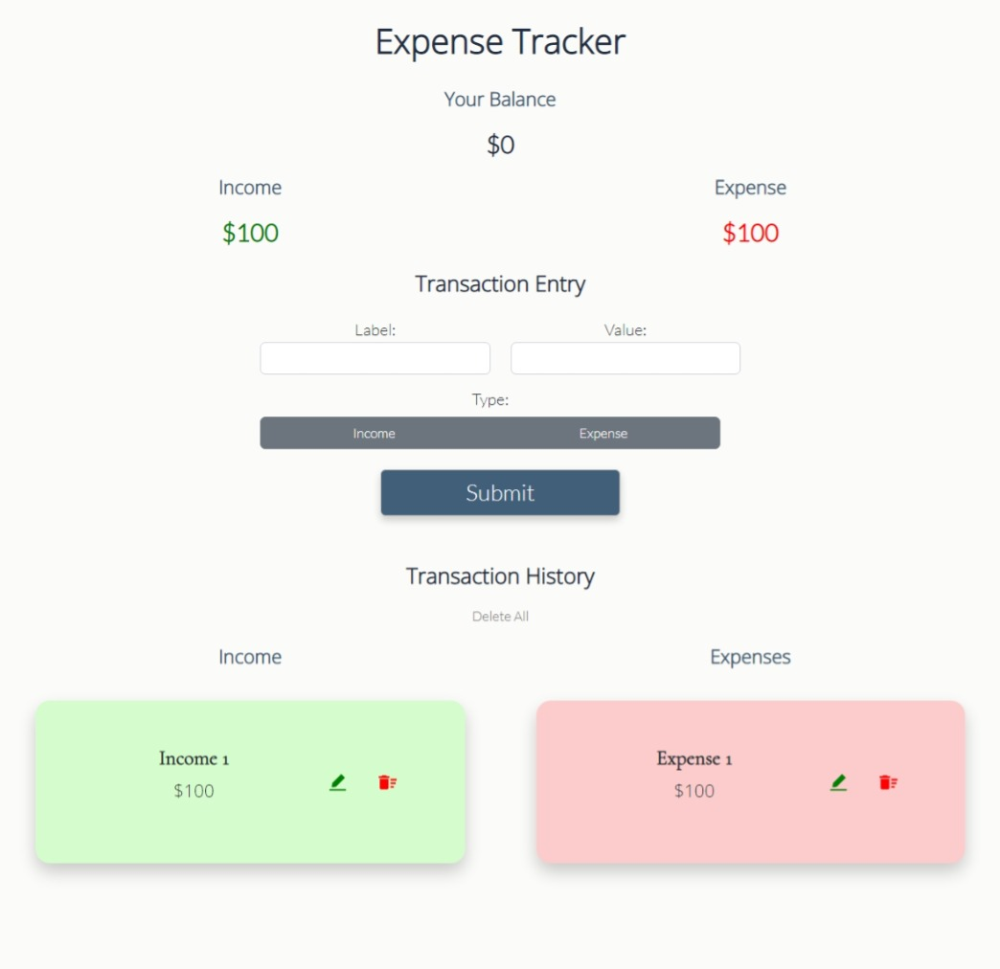
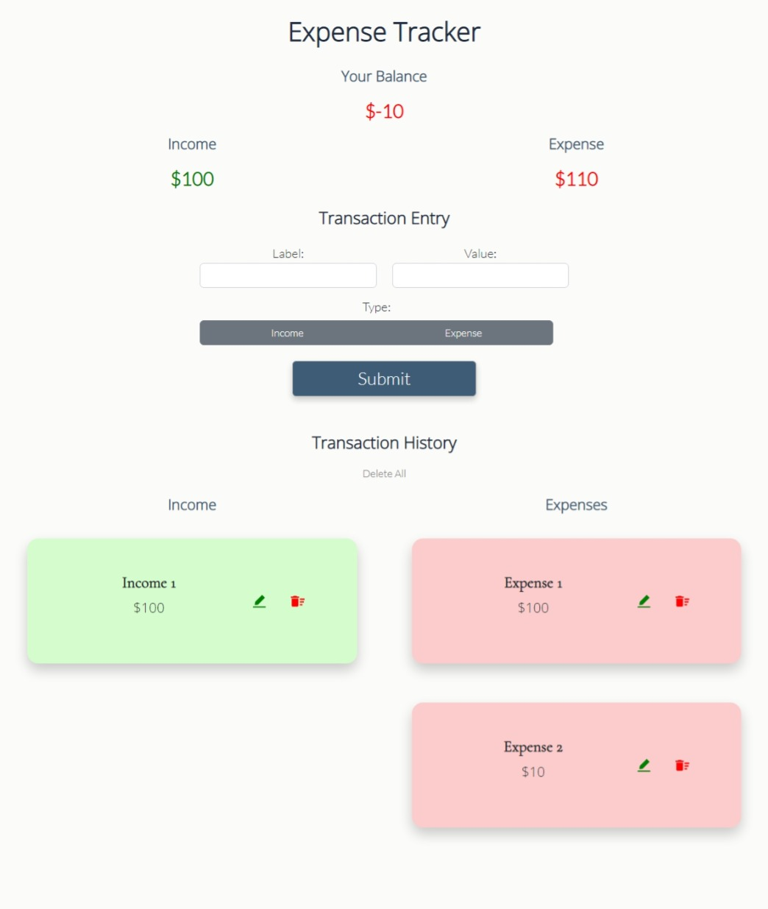
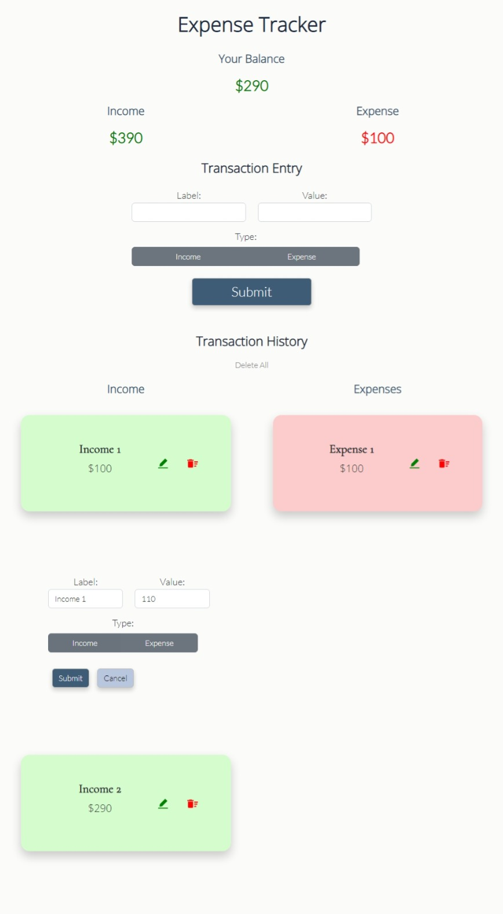
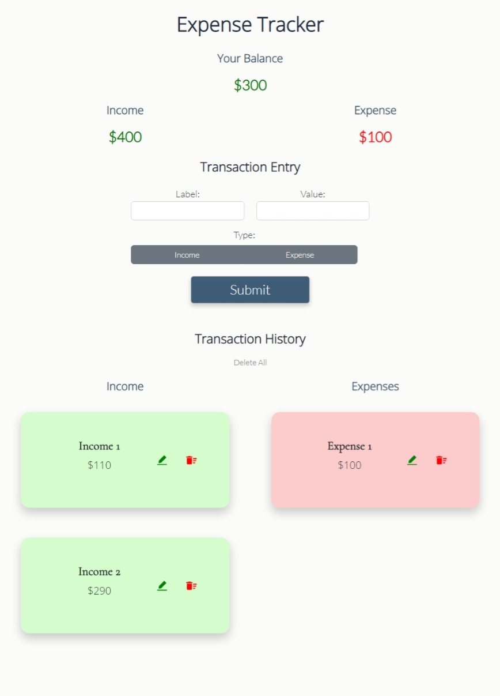
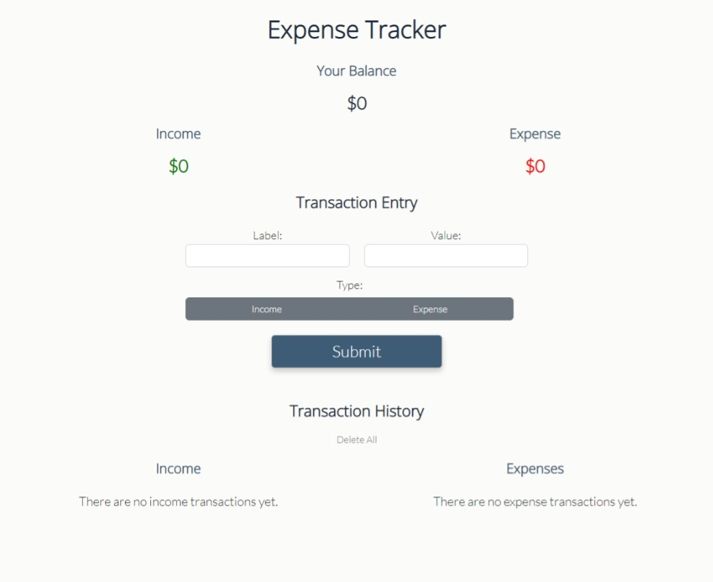
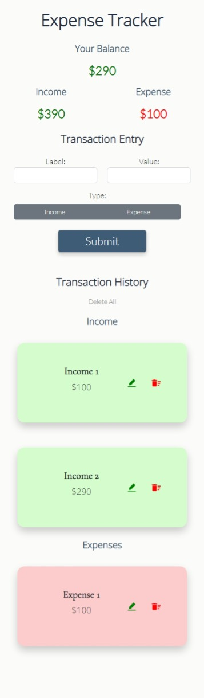

# Expense Tracker

A web-based application featuring an expense tracker. Built with React, JSX, Node.js, Express, MongoDB, Mongoose, Axios, JavaScript, Bootstrap, Reactstrap, and CSS. create-react-app was used to set up the front-end.

## Project Screen Shots

Expense Tracker Start Screen

To start, please enter a transaction in the Transaction Entry section.

Positive Total Updates Balance Figure to Green

 or deleted (with the red trashcan icon).")

After adding an income transaction, it will populate in the Income column of the Transaction History. Note that the Transaction detail section at the top will update the total for the Income column as well as the balance. Because the balance is positive, the total dollar amount value has turned green. Also, please note that each transaction can be either updated (with the green pencil icon) or deleted (with the red trashcan icon).

Zero Totals Will Reflect a Darker Color

If the income and expense transactions even out to zero, the Balance (aka total) field will reflect a darker color.

An Excess of Expense Transactions Will Reflect a Red Color for the Balance

When the total balance is a negative number, the Balance field will turn red.

Making Updates Is Easy

Clicking on the green pencil icon will open a menu under the transaction item where updates can be made.

Update Completed

After filling out the fields and clicking submit, the update will reflect onscreen. 

Delete All

By clicking the Delete All button under Transaction History, all entries will be deleted.

Responsive Design

The application has been designed to respond to the window size to maintain functionality when used on a smaller screen.

## Launch Note

Please note that this version of the project is for deployment only. Another version of the project is available that runs off of a local installation of mongoDB instead of requiring a mongoDB Atlas account, which is required to run this version.

## Reflection

I built this project after studying in the course focused on Node.js, Express, MongoDB, and Mongoose in NuCamp's Full Stack Web and Mobile Application Development Bootcamp. One of the challenges of this project included learning how to connect the backend to the frontend.

## References

- CodingTheSmartWay - "The MERN Stack Tutorial - Building a React CRUD Application from Start to Finish with MongoDB, Express, React, and Node.js" - https://codingthesmartway.com/the-mern-stack-tutorial-building-a-react-crud-application-from-start-to-finish-part-1/ (Inspiration for the initial setup of the frontend and the backend server.)
- Code With Sandip - "JavaScript Beginner Course | Practical JavaScript | Expense Tracker Application using JavaScript" - ht tps://www.youtube.com/watch?v=hAEL5beIbuw  (Inspiration for the project idea itself and some UI Design elements.)
- John Smilga - React Tutorial and Projects Course - Grocery Bud Mini Project - https://www.udemy.com/course/react-tutorial-and-projects-course/ (For additional inspiration regarding the React CRUD functionality.)

--------------------

This project was bootstrapped with [Create React App](https://github.com/facebook/create-react-app).

--------------------