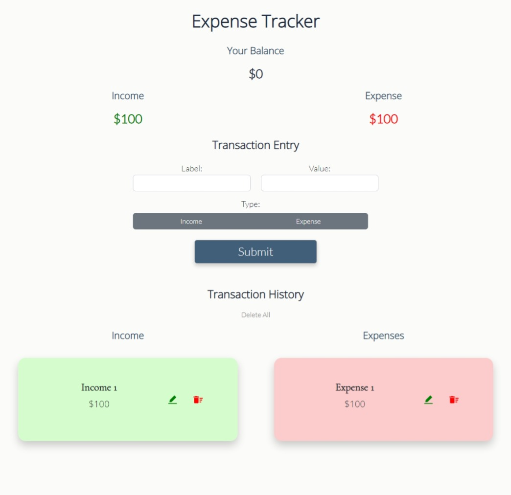
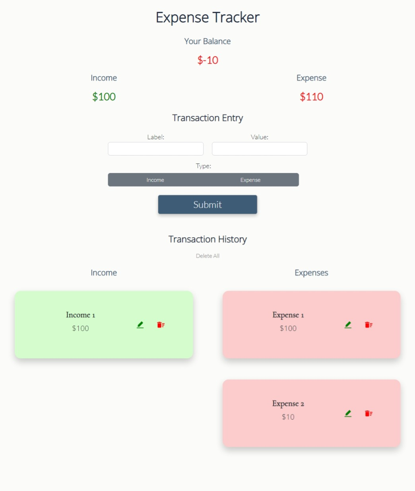
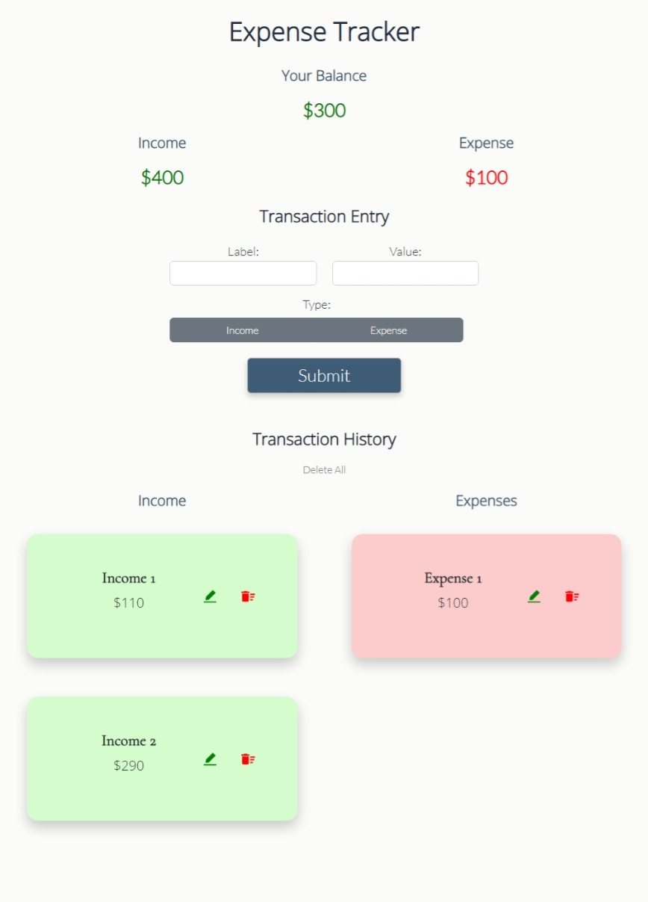
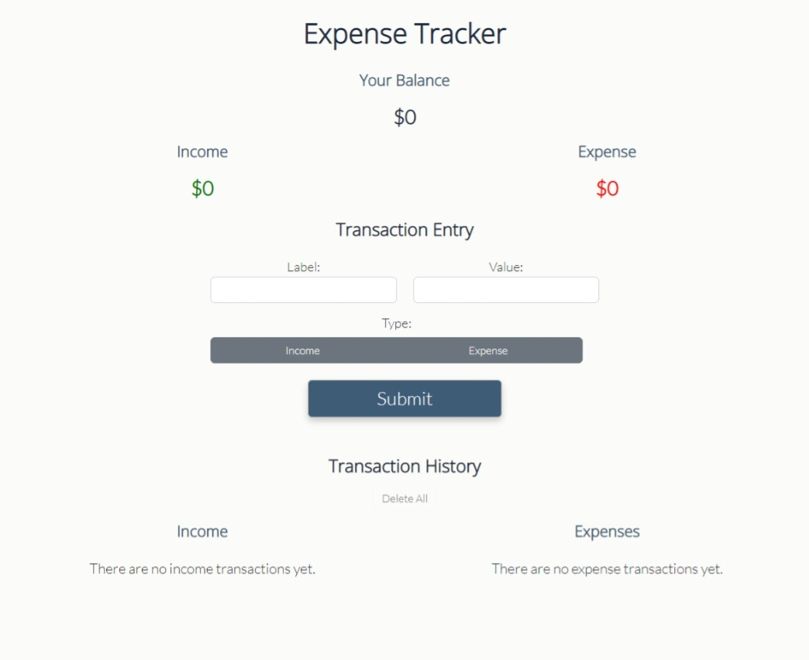

TEMPORARY NOTES:
npm start -- to start React
nodemon server -- from the backend folder
Also start the mongoDB.

# Expense Tracker

A web-based application featuring an expense tracker. Built with React, JSX, Node.js, Express, MongoDB, Mongoose, Axios, JavaScript, Bootstrap, Reactstrap, and CSS. create-react-app was used to set up the front-end.

## Project Screen Shots

Expense Tracker Start Screen

To start, please enter a transaction in the Transaction Entry section.

Positive Total Updates Balance Figure to Green

 or deleted (with the red trashcan icon).")

After adding an income transaction, it will populate in the Income column of the Transaction History. Note that the Transaction detail section at the top will update the total for the Income column as well as the balance. Because the balance is positive, the total dollar amount value has turned green. Also, please note that each transaction can be either updated (with the green pencil icon) or deleted (with the red trashcan icon).

Zero Totals Will Reflect a Darker Color

If the income and expense transactions even out to zero, the Balance (aka total) field will reflect a darker color.

An Excess of Expense Transactions Will Reflect a Red Color for the Balance

When the total balance is a negative number, the Balance field will turn red.

Making Updates Is Easy

Clicking on the green pencil icon will open a menu under the transaction item where updates can be made.

Update Completed

After filling out the fields and clicking submit, the update will reflect onscreen. 

Delete All

By clicking the Delete All button under Transaction History, all entries will be deleted.

Responsive Design

The application has been designed to respond to the window size to maintain functionality when used on a smaller screen.

## Launch Instructions

Clone this repository to your local machine. 

Navigate to the main project folder in the terminal and install the main packages for the front-end with the following command:

`npm install`

Next, please navigate to the backend folder and install the main packages for the back-end with the following command:

`npm install`

Next, you need to create your own MongoDB database, if you don't have one already. You can follow the installation instruction [here](https://www.mongodb.com/cloud/atlas). Alternatively, you could set up MongoDB locally. Please visit [here](https://www.prisma.io/dataguide/mongodb/setting-up-a-local-mongodb-database) for instructions.

Once MongoDB is set up, please ensure it's running (such as if you have installed it locally, it should be running in the terminal).

Now that all required installations are in place, to start the front-end, please open the main folder in the terminal and use the following command:

`npm start`

Please leave the above terminal open. After loading, the React application should launch in your web browser. Assuming you have no other applications running, the application should launch at:

[http://localhost:3000](http://localhost:3000)

The above command only launches the front-end. To start up the backend, please open a separate terminal, navigate to the backend folder, and run the following command:

`nodemon server`

The second terminal will also need to be left open and running while you are using the application.

**Please note that this application requires an internet connection.  

## Reflection

I built this project after studying in the course focused on Node.js, Express, MongoDB, and Mongoose in NuCamp's Full Stack Web and Mobile Application Development Bootcamp. One of the challenges of this project included learning how to connect the backend to the frontend.

## References

- CodingTheSmartWay - "The MERN Stack Tutorial - Building a React CRUD Application from Start to Finish with MongoDB, Express, React, and Node.js" - https://codingthesmartway.com/the-mern-stack-tutorial-building-a-react-crud-application-from-start-to-finish-part-1/ (Inspiration for the initial setup of the frontend and the backend server.)
- Code With Sandip - "JavaScript Beginner Course | Practical JavaScript | Expense Tracker Application using JavaScript" - https://www.youtube.com/watch?v=hAEL5beIbuw  (Inspiration for the project ideal itself and some UI Design elements.)
- John Smilga - React Tutorial and Projects Course - Grocery Bud Mini Project - https://www.udemy.com/course/react-tutorial-and-projects-course/ (For additional inspiration regarding the React CRUD setup.)

--------------------

This project was bootstrapped with [Create React App](https://github.com/facebook/create-react-app).

--------------------

### `npm run build`

Builds the app for production to the `build` folder.\
It correctly bundles React in production mode and optimizes the build for the best performance.

The build is minified and the filenames include the hashes.\
Your app is ready to be deployed!

See the section about [deployment](https://facebook.github.io/create-react-app/docs/deployment) for more information.

### `npm run eject`

**Note: this is a one-way operation. Once you `eject`, you can't go back!**

If you aren't satisfied with the build tool and configuration choices, you can `eject` at any time. This command will remove the single build dependency from your project.

Instead, it will copy all the configuration files and the transitive dependencies (webpack, Babel, ESLint, etc) right into your project so you have full control over them. All of the commands except `eject` will still work, but they will point to the copied scripts so you can tweak them. At this point you're on your own.

You don't have to ever use `eject`. The curated feature set is suitable for small and middle deployments, and you shouldn't feel obligated to use this feature. However we understand that this tool wouldn't be useful if you couldn't customize it when you are ready for it.

### Deployment

This section has moved here: [https://facebook.github.io/create-react-app/docs/deployment](https://facebook.github.io/create-react-app/docs/deployment)

### `npm run build` fails to minify

This section has moved here: [https://facebook.github.io/create-react-app/docs/troubleshooting#npm-run-build-fails-to-minify](https://facebook.github.io/create-react-app/docs/troubleshooting#npm-run-build-fails-to-minify)
